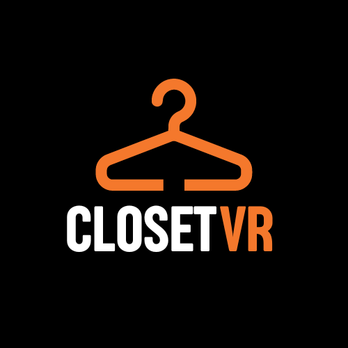

# ClosetVR 🥽📱👔👞: Esperienza di Shopping Virtuale Collaborativa XR

  

Benvenuti nel repository di ClosetVR, un'innovativa applicazione che unisce Realtà Virtuale (VR) e Realtà Aumentata (AR) per trasformare l'esperienza di shopping online.

## Descrizione dell'Applicazione

ClosetVR offre un ambiente collaborativo unico, in cui gli utenti possono esplorare e provare diversi capi di abbigliamento all'interno di un armadio virtuale. L'applicazione si compone di due componenti principali:

### Armadio Virtuale in Realtà Virtuale

Gli utenti possono immergersi in un ambiente virtuale realistico tramite visore VR. Qui, possono esplorare una vasta selezione di abiti virtuali, provarli sul proprio avatar VR e muoversi liberamente nello spazio virtuale. Puoi specchiarti e avere una reale sensazione di adattamento degli abiti al corpo.

### Applicazione di Realtà Aumentata

Per favorire l'accessibilità e coinvolgere un pubblico più ampio, ClosetVR offre un'applicazione Android di Realtà Aumentata. Gli utenti Android possono partecipare all'esperienza dell'armadio virtuale tramite un codice fornito dagli utenti in VR. Utilizzando lo smartphone, gli utenti vedono l'avatar VR in 
tempo reale e interagiscono con l'ambiente virtuale. Questo approccio permette a chi non possiede un visore VR di partecipare e offrire consigli agli utenti in Realtà Virtuale.

## Vantaggi dell'Applicazione

ClosetVR offre numerosi vantaggi:

1. **Accessibilità**: L'applicazione è più accessibile poiché consente agli utenti di partecipare con visori VR o smartphone Android, superando le limitazioni hardware.

2. **Flessibilità Geografica**: Gli utenti possono utilizzare l'applicazione ovunque si trovino, ricevendo consigli di moda istantanei e assistenza da consulenti in tutto il mondo.

3. **Interazione Sociale**: Favorisce l'interazione tra utenti attraverso la condivisione di esperienze in tempo reale e la comunicazione vocale e video.

## Come Contribuire

Siete invitati a contribuire al miglioramento di ClosetVR. Potete:

- Segnalare bug o problemi nell'applicazione.
- Sottoporre suggerimenti per nuove funzionalità.
- Contribuire con codice per migliorare l'applicazione.
- Migliorare la documentazione.

<!--## Licenza

Questo progetto è concesso in licenza sotto [Inserire la licenza appropriata]. -->
