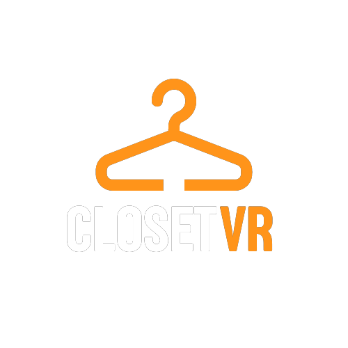
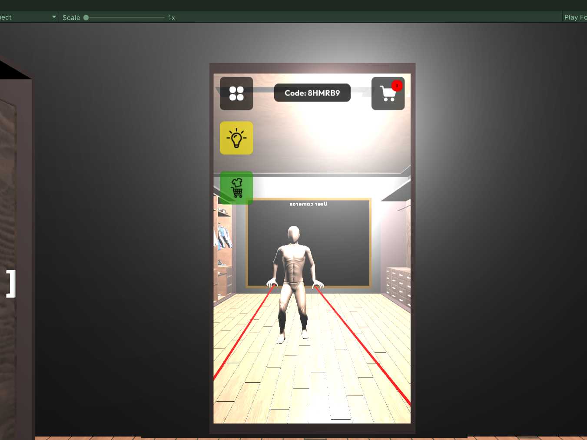
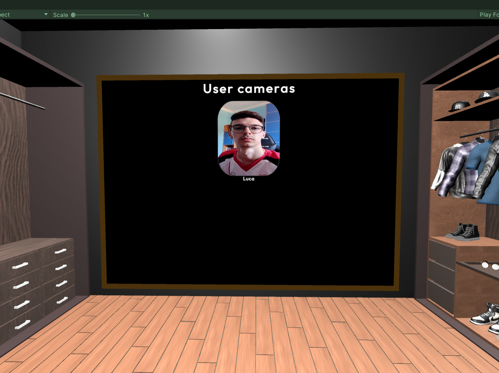

# ClosetVR 🥽📱👔👞: Esperienza di Shopping Virtuale Collaborativa XR

 <!--  
  Benvenuti nel repository di ClosetVR, un'innovativa applicazione che unisce Realtà Virtuale (VR) e Realtà Aumentata (AR) per trasformare l'esperienza di shopping online.
  !-->
  

     

**Benvenuti nel repository di ClosetVR, un'innovativa applicazione che unisce Realtà Virtuale (VR) e Realtà Aumentata (AR) per trasformare l'esperienza di shopping online.**

   

---

## Descrizione dell'Applicazione

ClosetVR offre un ambiente collaborativo unico, in cui gli utenti possono esplorare e provare diversi capi di abbigliamento all'interno di un armadio virtuale. ClosetVR si basa su un concetto innovativo che mira a rivoluzionare il settore della moda e dell’x-commerce, consentendo alle persone di sperimentare capi di abbigliamento in un ambiente virtuale realistico prima di prendere una decisione di acquisto. L'applicazione si compone di due componenti principali:

### Armadio Virtuale in Realtà Virtuale
Al centro dell’applicazione c’è l’armadio virtuale, accessibile tramite un visore di Realtà Virtuale. Qui, gli utenti possono immergersi in un ambiente virtuale realistico, esplorare una vasta selezione di capi di abbigliamento virtuali e provarli sul loro avatar VR. Avranno la possibilità di muoversi liberamente all’interno dello spazio virtuale e di vedersi allo specchio, ottenendo una reale sensazione di come i vestiti si adattino al loro corpo;

    
    
    

### Applicazione di Realtà Aumentata
Per favorire l’accessibilità e coinvolgere un pubblico più ampio, ClosetVR offre un’applicazione Android di Realtà Aumentata. Gli utenti Android possono unirsi all’esperienza dell’armadio virtuale attraverso un codice fornito dalla persona in VR. Utilizzando il loro smartphone, gli utenti potranno vedere l’avatar VR in tempo reale e interagire con l’ambiente virtuale. Questo approccio consente agli utenti che non possiedono un visore VR di partecipare e di poter dare consigli alla persona in realtà virtuale, senza dover essere fisicamente presenti nella stessa stanza.

    
    
    

## Interazione sociale
ClosetVR offre la possibilità di interazione e comunicazione tra la persona in Realtà Virtuale e gli utenti Android. La persona in VR potrà visualizzare la camera frontale dell'utente Android su un apposito muro dell'armadio virtuale, creando un'esperienza ancora più coinvolgente. Inoltre, grazie alla funzione di comunicazione vocale, la persona in VR potrà comunicare con l'utente Android tramite il microfono del visore, consentendo scambi di opinioni, suggerimenti e consigli sui capi di abbigliamento provati.

## Vantaggi
La nostra applicazione porta con sé diversi vantaggi: 
1. **Accessibilità**: offre un’esperienza di shopping virtuale più accessibile, poiché consente agli utenti di partecipare avendo a disposizione un solo visore VR, ma tanti smartphone Android. In questo modo, si supera la barriera dell’attrezzatura specifica, rendendo l’esperienza disponibile a un pubblico più ampio;
2. **Utilizzabile in qualsiasi momento da qualsiasi parte del mondo**: grazie alla possibilità di utilizzare l’applicazione in qualsiasi momento e da qualsiasi parte del mondo, la persona in Realtà Virtuale ha accesso a consigli di moda immediati, mentre i consulenti possono fornire assistenza ovunque si trovino. Questa flessibilità contribuisce a rendere l’esperienza dell’armadio virtuale più pratica e coinvolgente;
3. **Contatto umano e realismo**: è un ambiente sociale in cui gli utenti possono condividere l’esperienza con amici e familiari, favorendo una maggiore interazione e un maggiore coinvolgimento. Questo perché consente agli utenti di vedere l’avatar VR in tempo reale e di comunicare attraverso la voce e il video, mantenendo una connessione ancora più reale con gli altri partecipanti.

## Come Contribuire

Siete invitati a contribuire al miglioramento di ClosetVR. Potete:

- Segnalare bug o problemi nell'applicazione.
- Sottoporre suggerimenti per nuove funzionalità.
- Contribuire con codice per migliorare l'applicazione.
- Migliorare la documentazione.

## Licenza

Questo progetto è concesso in licenza sotto [!!!!Inserire la licenza appropriata!!!!!!!].
